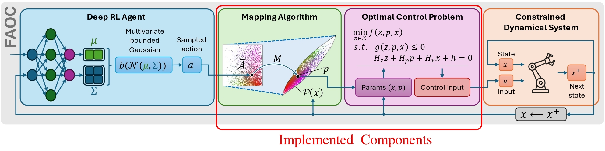
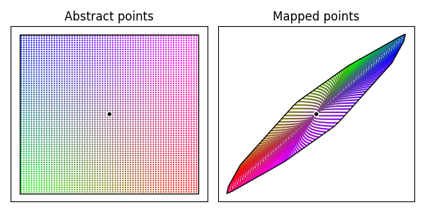
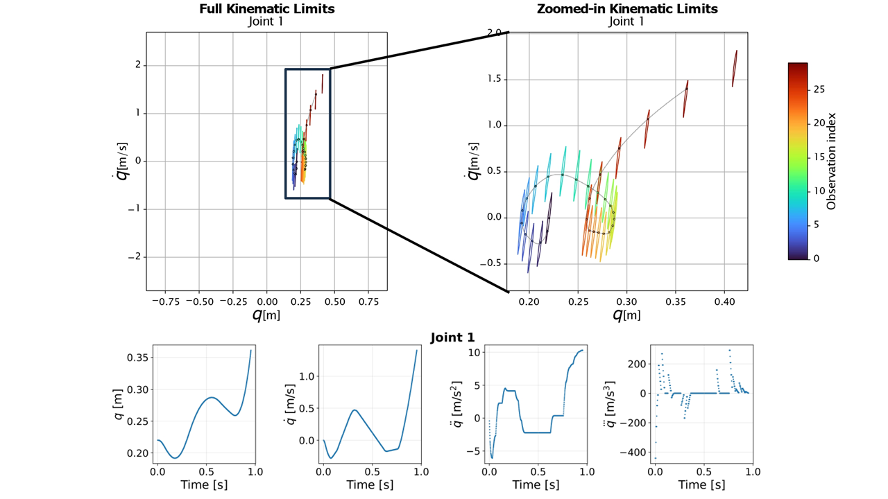
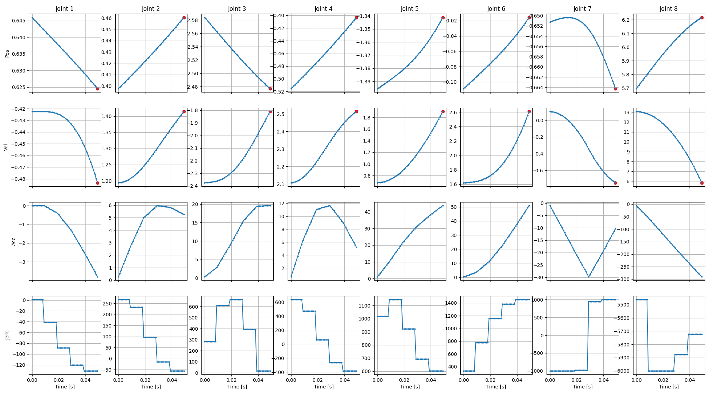

[](https://github.com/SonyResearch/feasible_action_for_optimal_control/actions/workflows/static-checks.yml)
[](https://github.com/SonyResearch/feasible_action_for_optimal_control/actions/workflows/tests.yml)

# Feasible Action for Optimal Control (FAOC)

Lightweight implementation of the Mapping Algorithm and Motion Planning Optimal Control Problem from the FAOC framework for controlling dynamical systems.
This implementation, combined with a Reinforcement Learning agent, was used for controlling the ACE robot in the 2026 work [*Outplaying elite table tennis players with an autonomous robot*](https://www.nature.com/articles/s41586-026-10338-5).



> [!NOTE]
> The current implementation supports only Cubic splines and 1- or 2-dimensional action spaces.

## Citing our work
A preprint is currently available at [arXiv](https://arxiv.org/abs/2607.23930).
```
@misc{richter2026bridgingreinforcementlearningoptimal,
      title={Bridging Reinforcement Learning and Optimal Control via Feasible Action Mapping}, 
      author={Stefan Richter and Alberto Giammarino and Guillem Torrente and Sam Blakeman and Peter Dürr},
      year={2026},
      eprint={2607.23930},
      archivePrefix={arXiv},
      primaryClass={eess.SY},
      url={https://arxiv.org/abs/2607.23930}, 
}
```

## What is FAOC?

FAOC is a control framework that provides a geometrically simple, static action space, which does not represent any physical quantity, which we therefore denote as _abstract_, for controlling a constrained dynamical system with e.g. Reinforcement Learning (RL).
Abstract actions $\bar{a}$ selected from abstract action space $\bar{\mathcal{A}}$ automatically yield a unique feasible trajectory to control the system in open loop for a short window of time. This is possible through a novel mapping which maps the chosen abstract action to the set of feasible terminal constraints for the underlying motion planning problem, given the current state of the system (we denote this set as $\mathcal{P}(x)$ ). This mapping is bijective, invertible, and it takes into account of the sets' shapes such that distributions do not degenerate when mapped (i.e. distortions of the mapped distribution are reduced, see Fig.2 in the paper), so it is easy to explore the action space and learn how to select the optimal actions.

The following is a visualization of the mapping for a particular control problem (note the shape of the target set depends on the constraints and the current state of the system and is implicitly inferred):



See [the practical example](#example-joint-control-of-an-8-dof-robot-arm) for more information about how to use FAOC.

## Getting started
### Recommended prerequisites for building and using FAOC in an Ubuntu system:

- CMake 3.22
- Clang 14
- Eigen 3.4.0
- Python >= 3.10
- Pybind11 2.6.2
- Numpy 1.26.4 (<2 necessary)
- DAQP 0.8.6
- QHull 8.0
- C-Thread-Pool


Installation instructions:
```bash
sudo ./scripts/install_3rd_party_dependencies.sh
```

### Building and installing FAOC:

The easiest way to build and install FAOC is using pip:
```bash
pip install .
```

For development installations (editable mode):
```bash
pip install -e .
```

Alternatively, to build a wheel for distribution:
```bash
pip install build
python -m build --wheel
```

For manual CMake-based installation:
```bash
mkdir build
cd build
cmake .. \
    -DCMAKE_C_COMPILER=/usr/bin/clang-14 \
    -DCMAKE_CXX_COMPILER=/usr/bin/clang++-14 \
    -DCMAKE_BUILD_TYPE=Release \
    -DCMAKE_INSTALL_PREFIX=$HOME/.local
make -j4
make install
```

## Example: Joint control of an 8-DoF robot arm
See Equation 9 in the paper for the mathematical formulation of the Optimal Control Problem (OCP) for motion planning.
FAOC allows to generate smooth trajectories for a robot system. These trajectories are composed of shorter _trajectory segments_, solution of consecutive OCPs, that are concatenated. Each _trajectory segment_ represents a decision in a Markov decision process (MDP). Therefore, when learning a task through reinforcement learning (RL), each action corresponds to a _trajectory segment_. In our application of motion planning for robotic table tennis, the action is the desired 1D (position) or 2D (position-velocity) subset of the terminal state of the _trajectory segment_ (the state in the formulation is position-velocity-acceleration, since the _trajectory segment_ consists of concatenated cubic polynomials).

FAOC hyperparameters:
- **Closed loop control frequency** or **RL frequency** `1/(tau_c*n_l)`: This is the frequency at which a high-level agent, e.g. an RL agent, chooses abstract actions. For instance, we could choose to control the arm at 20Hz. This implies that we need to generate **trajectory segments of 50ms in length**. As briefly mentioned above, one trajectory segment in turn consists of `n_l` (corresponding to $N$ in the paper) concatenated cubic polynomials (each having costant jerk) of length `tau_c` (corresponding to $T$ in the paper). Therefore, the closed loop control frequency is implicitly determined by `n_l` and `tau_c` in the code. In the code example below, `n_l=5` cubic polynomials and `tau_c=0.01` seconds, and the trajectory segment length is therefore `tau_c*n_l=0.05` seconds (i.e. 50ms). In general, a lower bound for `n_l` exists for the OCP to not be ill defined, which is checked in the code, while `tau_c` controls the frequency of the OCP and has other complex implications we don't discuss here.
- **Motion plan frequency** `sampling_freq`: This should be set to the low-level control frequency of the system, e.g. 1000Hz. The OCP solution composed of continuous-time polynomials will be sampled at this frequency. In the code example below `sampling_freq=1000`Hz.
- **Action space dimension** `abstract_set_dim`: Our current implementation supports 1 or 2 dimensional abstract action spaces per joint. The first dimension maps to the terminal joint position, and the second one to the joint velocity. In the code example below `abstract_set_dim=2`.

Below, we illustrate how FAOC works more in detail. Top: the executed sequence of actions (black dots), position--velocity trajectories (gray lines) and feasible polytopes for one robot joint during a robot shot. On the top-left, the ranges for the $x$-axis (position) and $y$-axis (velocity) correspond to the full kinematic limits of that joint. On the top-right, the axes are magnified for the range used during that particular motion. The feasible polytopes are small due to the relatively high control frequency of 31.25Hz. Bottom: corresponding position, velocity, acceleration, and jerk trajectories as a function of time.



### Using the Python library
After the build and installation are successful, one can import the python libraries by simply:
```py
from faoc import CubicSpline, MPOnlineSettings, JointData, ObjectiveFunction
from faoc_utils import EXIT_SUCCESSFUL, get_solution_dict, stack_solution
```

To initialize the FAOC class, the kinodynamic limits of the system must be provided.
The implementation assumes that velocity, acceleration and jerk limits are symmetric (i.e. v_max = -v_min and so on).
Additionally, whether the robot kinematic structure is symmetrical about a specific axis or not must also be specified.
For example, a humanoid robot is usually symmetric along the body length axis.
Symmetry properties can be useful for augmenting the training data by mirroring the motion plans along such an axis.
For every joint, one of the following options must be selected
- `0`: the robot does not have an axis of symmetry, or symmetric augmentation is not needed. If at least one joint has this value, then mirroring functions will be entirely disabled, and will return an error code if called.
- `1`: the robot has an axis of symmetry, but the joint does not apply (for example, a revolute joint with the axis of rotation perpendicular to the symmetry axis)
- `-1`: otherwise
```py
    # This data corresponds to the configuration of the ACE table tennis robot
    joint_data = JointData(
        joint_mirroring=[1, -1, -1, -1, -1, -1, -1, -1],
        joint_pos_min=[-0.925, -0.675, -3.14, -1.57, -3.14, -2.44, -2.40, -6.28],
        joint_pos_max=[0.925, 0.675, 3.14, 1.57, 3.14, 2.44, 2.40, 6.28],
        joint_vel_max=[4.,  4.,  7.85,  7.85, 12.56, 12.56, 7.85, 31.42],
        joint_acc_max=[10.8, 15.7, 39.27, 39.27, 125.66, 125.66, 78.54, 628.32],
        joint_jerk_max=[ 600., 600., 750., 750., 1500., 1500., 1000., 6000.]
    )
```

The FAOC class is initialized as follows.
`MPOnlineSettings` supports optional arguments to limit the computation time for the motion planning, but for most applications, it can be initialized by default.
```py
    faoc = CubicSpline(
        tau_c=0.01,                   # Length of one cubic polynomial in seconds, corresponding to T in the paper
        n_l=5,                        # Number of polynomials per segment, corresponding to N in the paper
        sampling_freq=1000,           # Sampling frequency of the robot
        n_joints=len(joint_data.mirroring_logic),
        abstract_set_dim=2,           # Dimensionality of the action space, corresponding to n in the paper
        joint_data=joint_data,
        online_settings=MPOnlineSettings(),
    )
    status = faoc.initialize(ObjectiveFunction.difference)
```

The initial configuration of the system must be informed to the solver as follows. The initial state is an `n_joints x 3` matrix composed of the initial joint positions, velocities and accelerations. The initial state must be within the kinodynamic limits specified in `JointData`.
```py
x_0 = np.zeros((len(joint_data.mirroring_logic), 3))
status = faoc.set_initial_state(x_0)
```

Finally, the following steps are repeatedly executed, where `action` is an `n_joints x 1` or `n_joints x 2` matrix (depending on the abstract set dimension). 
Note that the FAOC calls should in practice be run in parallel to the execution to ensure that the next solution plan is available before the previous one ends.
```py
for step in steps:
    action = get_faoc_action()  # Using an RL agent or other control policy
    status = faoc.set_abstract_action_and_solve(action)
    sol = get_solution_dict(faoc, "last")
    robot.execute(sol)

# Reset the FAOC state for the next episode
faoc.reset()
```

### Visualization of the motion plan generated by FAOC for one action:
The 2D action mapped into the feasible set of terminal constraints is denoted with the red dot in the position and velocity rows for all joints. 
The FAOC solution consists of 5 concatenated cubic splines (with piece-wise constaint jerk) that connect the current state of the system (in position, velocity and acceleration) to the desired terminal state.
Since each spline is 10ms long, the total solution lasts for 50ms, and since the robot control frequency is 1000Hz, it has 50 samples in total. 



For more information and examples, including the usage of the symmetric augmentation, fallback deceleration trajectory planning and more, take a look at the [Python unit tests](test/test_python_bindings.py).


## Contributing
This repository will be released as an archived repository and will not be maintained.

